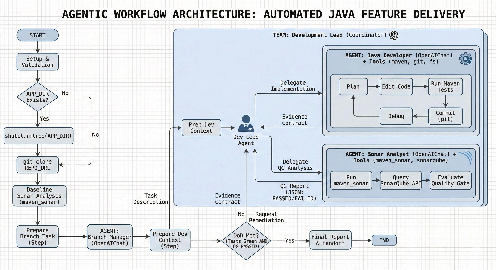

# Code Force DEMO

**Code Force DEMO** demonstrates an end-to-end *agentic* delivery workflow for a Java/Spring Boot backend using **GPT-class models** and **SonarQube Quality Gates**.

At a high level, you provide a ticket-like task description. The system then:

1. Clones a target Git repository you prepared (seeded with the demo backend code).
2. Creates a task-specific branch via a “Branch Manager” agent.
3. Delegates implementation to a small, coordinated agent team:
   - **Development Lead (Coordinator)**: orchestrates work and verifies evidence
   - **Developer**: implements the feature, runs Maven tests, commits changes
   - **Sonar Analyst**: runs Sonar analysis and evaluates the Quality Gate
4. Iterates until **tests are green** and the **SonarQube Quality Gate is PASSED**.

This repo contains the orchestrator script (`code_force_demo.py`), agent prompts, and tooling integration to reproduce the demo locally.

This demo has been pusblished on my LinkedIn account.

- **LinkedIn post:** <LINK_TO_LINKEDIN_POST>

---

## Architecture



**Workflow summary (aligned with the diagram):**

- **Setup & validation**: validate required CLI tools and environment variables.
- **Clone**: delete the working directory if it exists, then `git clone` the target repo.
- **Baseline analysis**: run a first Sonar scan to establish a baseline.
- **Branching**: Branch Manager agent creates a conventional branch name and creates/checks out the branch.
- **Implementation loop** (coordinated by Development Lead):
  - Developer plans → edits code → runs Maven tests → commits.
  - Sonar Analyst runs `maven_sonar` and checks Quality Gate.
  - If the gate fails, the Coordinator requests remediation and repeats until PASSED.
- **Definition of Done**: tests green **and** Quality Gate PASSED, then final report/handoff.

> Important: the included Sonar Analyst prompt is written for **SonarQube Community Edition** (no branch analysis because community version don't support it, this is only a demo). Scans are performed against a single project key; do not rely on branch analysis features.

---

## What you will run locally

- **SonarQube Community** (container)
- **PostgreSQL** for SonarQube (container)
- **MySQL** for the demo backend application (container)
- **Python orchestrator** (this repo) that uses:
  - `git` and `mvn` as local CLIs
  - MCP tool images: `mcp/sonarqube`, `mcp/filesystem`

---

## Prerequisites

### Required software

- Docker
- Git
- Oracle JDK 21
- Maven (3.9+)
- Python 3 (recommended: 3.13+)

The script validates the presence of `git`, `mvn`, and `docker` at startup.

### Credentials

- **LLM provider API key** (OpenAI by default)
- **SonarQube user token** (for SonarQube API access)

---

## Repository preparation (seed repository)

This demo expects a **separate Git repository** containing the backend project to modify.

1. Unzip `bike_backend.zip` to obtain a `bike_backend/` directory.
2. Create a new repository (e.g., on GitHub).
3. Commit and push the `bike_backend/` contents.
4. Keep the repository URL; you will set it as `GIT_REPO_URL` in `.env`.

---

## Local setup

### 1) Start SonarQube + PostgreSQL

#### Create Docker volumes

```bash
docker volume create sonarqube_conf
docker volume create sonarqube_data
docker volume create sonarqube_extensions
docker volume create sonarqube_logs
docker volume create postgres_data
```

#### Start PostgreSQL for SonarQube

```bash
docker run -d --name postgres-sonarqube \
  -e POSTGRES_USER=sonar \
  -e POSTGRES_PASSWORD=sonarpass \
  -e POSTGRES_DB=sonarqube \
  -v postgres_data:/var/lib/postgresql/data \
  postgres:15
```

#### Start SonarQube Community

```bash
docker run -d --name sonarqube \
  --link postgres-sonarqube:db \
  -e SONAR_JDBC_URL=jdbc:postgresql://db:5432/sonarqube \
  -e SONAR_JDBC_USERNAME=sonar \
  -e SONAR_JDBC_PASSWORD=sonarpass \
  -p 9000:9000 \
  -v sonarqube_conf:/opt/sonarqube/conf \
  -v sonarqube_data:/opt/sonarqube/data \
  -v sonarqube_extensions:/opt/sonarqube/extensions \
  -v sonarqube_logs:/opt/sonarqube/logs \
  sonarqube:community
```

Open SonarQube:

- http://localhost:9000

Log in as `admin`, change the password when prompted, and proceed.

---

### 2) Generate a SonarQube user token

1. SonarQube UI → user profile → **Security**
2. Create a **User Token**
3. Copy it and set it in `.env` as `SONARQUBE_TOKEN`

---

### 3) Start MySQL and create the application database

#### Run MySQL

```bash
docker run --name mysql -d \
  -p 3306:3306 \
  -e MYSQL_ROOT_PASSWORD=1234567890 \
  -v mysql:/var/lib/mysql \
  mysql:lts
```

#### Create the `bike_backend` database

```bash
docker exec -it mysql bash
mysql -u root -p
```

Then:

```sql
CREATE DATABASE bike_backend;
```

Exit:

```sql
exit;
```

---

### 4) Pre-pull MCP tool images (recommended)

```bash
docker pull mcp/sonarqube
docker pull mcp/filesystem
```

---

### 5) Testcontainers safeguard (recommended)

If your Java tests use Testcontainers and Docker detection is flaky, create:

```bash
touch ~/.docker-java.properties
```

And Add:

```text
api.version=1.44
```

---

## Python setup

From the root of this repository:

```bash
python -m venv .venv
source .venv/bin/activate
pip install -r requirements.txt
```

---

## Configuration (.env)

Create a `.env` file in this repository’s root.

### Required variables

These variables are used directly by the orchestrator (`code_force_demo.py`). fileciteturn0file0

```env
AGNO_TELEMETRY=false
AGNO_MONITOR=False

JAVA_HOME=/usr/java/jdk-21-oracle-x64

# CRITICAL: use a dedicated working directory.
# The script DELETES APP_DIR if it already exists. In the demo i used '/tmp/bike_backend' as APP_DIR
APP_DIR=/absolute/path/to/a/safe/workdir/bike_backend

# Target repository seeded with bike_backend/ code
GIT_REPO_URL=https://github.com/<you>/<your-seeded-backend-repo>.git

# SonarQube
SONARQUBE_URL=http://localhost:9000
SONARQUBE_TOKEN=<your_sonarqube_user_token>
SONARQUBE_PROJECT_KEY=bike_backend

# Models (OpenAI by default in this demo)
GENERIC_MODEL_ID=<model-id-for-branch-dev-sonar>
COORDINATOR_MODEL_ID=<model-id-for-coordinator>

# Provider key (required by the OpenAIChat model)
OPENAI_API_KEY=<your_openai_api_key>
```

### Critical safety note about `APP_DIR`

The script will **recursively delete** `APP_DIR` if it exists before cloning. fileciteturn0file0  
Always point `APP_DIR` to a **dedicated, empty working directory** (never your home directory, never this repo’s root, never a directory with valuable files).

### SonarQube project key

`SONARQUBE_PROJECT_KEY` is used as both `sonar.projectKey` and `sonar.projectName` during scans. fileciteturn0file0  
On first run, SonarQube typically creates the project automatically if your token has permission to create projects.

---

## Running the demo

Pre-flight checklist:

- Docker is running
- Containers are up: `sonarqube`, `postgres-sonarqube`, `mysql`
- SonarQube UI loads at http://localhost:9000
- `.env` is present and includes **at least**: `APP_DIR`, `GIT_REPO_URL`, `SONARQUBE_TOKEN`
- Python venv is activated

Run:

```bash
python code_force_demo.py
```

The default script includes a sample ticket payload inside `code_force_demo.py` (see `TASK_PAYLOAD`). You can replace that payload with your own task description.

---

## Notes on SonarQube Community Edition

- SonarQube Community **does not support branch analysis**.
- The Sonar Analyst agent is explicitly instructed **not** to pass `-Dsonar.branch.name`.
- All scans are executed against the same `SONARQUBE_PROJECT_KEY`.

If you want true per-branch analysis, you must use a SonarQube edition that supports it and adjust the tooling and prompts accordingly like SonarQube Developer or Enterprise.

---

## Troubleshooting

### SonarQube not reachable
- Check logs: `docker logs sonarqube`
- Verify port mapping: `-p 9000:9000`

### Token issues
- Recreate the token in SonarQube UI → Security
- Confirm `.env` uses `SONARQUBE_TOKEN` (not a different variable name)

### Git clone fails
- Confirm `GIT_REPO_URL` is correct and accessible
- If using SSH URLs, ensure your local SSH keys are configured

### Maven fails
- Ensure `mvn` is installed and on PATH
- Run `mvn -v` to confirm Java/Maven are detected

---

## Clean up

Stop containers:

```bash
docker stop sonarqube postgres-sonarqube mysql
```

Remove containers:

```bash
docker rm sonarqube postgres-sonarqube mysql
```

Remove volumes (deletes stored data):

```bash
docker volume rm sonarqube_conf sonarqube_data sonarqube_extensions sonarqube_logs postgres_data mysql
```

---

## License

This project is licensed under the Apache License, Version 2.0.
- Include an accompanying LICENSE file with the full Apache 2.0 text.
- Unless required by applicable law or agreed to in writing, software distributed under the License is provided on an “AS IS” basis, without warranties or conditions of any kind.

---

## Disclaimer

This repository is a DEMO intended for educational purposes only.

You are solely responsible for how you use this software and for validating any outputs produced by AI agents. The author(s) assume no liability for misuse, damages, security incidents, data loss, or failures arising from execution, configuration, or modification of this demo.

Software is provided “AS IS”, without warranties or conditions of any kind.
